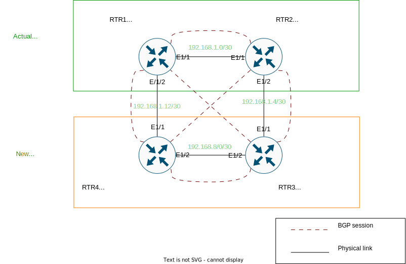

# Lab SOT

## Contexte :

Le réseau opérateur dont vous êtes responsable a d'importantes perspectives de croissance et vous aller devoir introduire rapidement de nouveaux équipements réseau.

Vous êtes en charge de l'exploitation de ce réseau et le temps étant limité vous souhaitez gérer vos configurations d'équipement de manière automatisée.

L'équipe a peu de connaissances en développement pour l'instant donc il faut trouver un moyen de provisionner les configurations avec le moins de développement possible.

Un ancien collègue vous parle de l'outil Nautobot, qu'ils utilisent dont son entreprise. Vous décidez d'expérimenter cet outil.

L'architecture réseau évolue et passe de 2 à 4 équipements :

Une configuration minimale est déployée sur les nouveaux équipements (on omet ici la partie ZTP qui permettrait de réaliser cela automatiquement).

Configurer Nautobot et créer un ou plusieurs playbooks pour configurer l'ensemble de votre réseau. Vous pourrez pour cela vous appuyer sur Ansible et le language de templating jinja2.

## Attendu :

* L'ensemble des données "variables" doivent être issues de Nautobot

* En cas de RAZ des configurations du lab, l'exécution d'un playbook doit pouvoir reconfigurer l'ensemble du réseau

* Une modification de configuration manuelle doit pouvoir être détectée et corrigée

* Bonus : les données opérationnelles (statut des interfaces, version, uptime,...) seront remontés dans nautobot automatiquement

L'ensemble des fichiers créés dans le dossier workdir seront à rendre avec un compte-rendu qui présentera la solution que vous avez réalisée.

Vous conclurez en répondant aux questions suivantes :

* que pensez-vous de la solution réalisée : quelles sont ses avantages par rapport à une gestion manuelle et quelles sont ses limites / faiblesses ?

* Que feriez-vous différemment / en plus pour automatiser l'exploitation de votre réseau ?

## Mise en place en l'infrastructure :

Lancement des équipements réseau, des containers nautobot et ansible :

    containerlab deploy

L'interface web de nautobot est disponible sur **http://127.0.0.1:8000** avec le login/password demo/nautobot

importer les donnes données initiales

    docker exec clab-lab-nautobot su -c "psql -c 'DROP DATABASE nautobot WITH (FORCE);'" postgres
    docker exec clab-lab-nautobot su -c "psql -c 'create database nautobot'" postgres
    docker exec clab-lab-nautobot su -c "psql nautobot < /tmp/nautobot.sql" postgres

Pour voir le contenu de l'inventaire dynamique

    docker exec clab-lab-lab-mgmt ansible-inventory -i /workdir/inventory.yml --graph